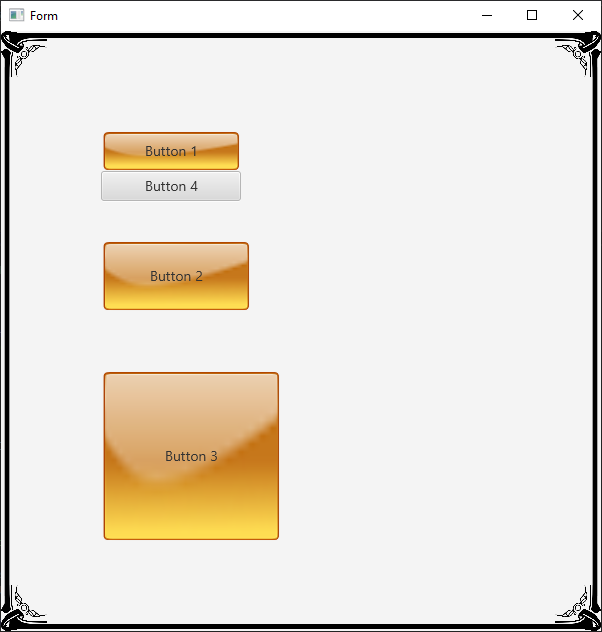

### BorderImage

This is a wrap of the javafx class BorderImage and associated classes. It is like an Android 9 Patch for Javafx.

Forum link [Javafx BorderImage](https://www.b4x.com/android/forum/threads/javafx-borderimage-similar-to-android-9-patch.127799/#content)

At a minimum you specify the image, border width, border Insets, and slice width. The methods in BorderImage_Utils provide shortcuts to creating a border image. Or you can take full control and specify everything yourself if necessary.
